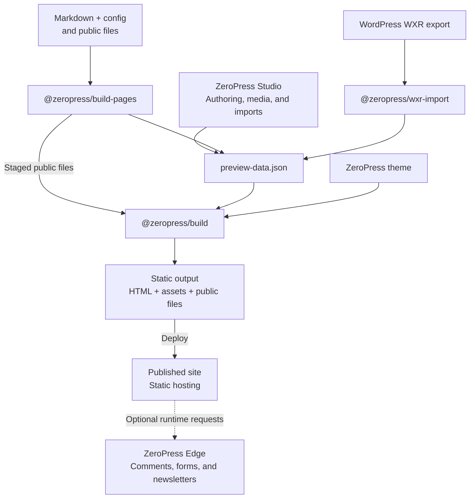

# ZeroPress

ZeroPress is a static-first publishing platform for Markdown sites, structured content, reusable themes, WordPress migration, and CMS-grade authoring workflows.

This organization contains the official repositories for the ZeroPress platform, including public sites, Build Pages, the WXR import bridge, theme tooling, runtime validators, Studio, Edge, and contract documentation.

## Start Here

- [zeropress.app](https://zeropress.app/): product overview and public entry point for ZeroPress.
- [studio.zeropress.dev](https://studio.zeropress.dev/): product documentation for managed authoring, media, migration, and publishing with ZeroPress Studio.
- [build-pages.zeropress.dev](https://build-pages.zeropress.dev/): product documentation for turning a Markdown source directory into a static ZeroPress site.
- [zeropress.page](https://zeropress.page/): bundled theme previews and source examples for Build Pages sites.
- [zeropress.dev](https://zeropress.dev/): technical documentation for preview-data, theme runtime, theme authoring, and CLI contracts.
- [schemas.zeropress.dev](https://schemas.zeropress.dev/): canonical JSON Schema host for ZeroPress contract files.
- [`@zeropress/wxr-import`](https://github.com/zeropress-app/zeropress-wxr-import): WordPress migration CLI for producing canonical Preview Data.

Choose a publishing workflow:

- Markdown document publishing with `@zeropress/build-pages`
- WordPress migration from WXR exports with `@zeropress/wxr-import`, followed by `@zeropress/build`
- Managed authoring, media management, WordPress import, and publishing with ZeroPress Studio
- Direct static builds from `preview-data.json` and a ZeroPress theme with `@zeropress/build`

## Project Status

All ZeroPress packages are currently in the beta stage.

During beta, the focus is validation, documentation, real-world testing, and defect correction. Public availability and release timing are announced separately after review.

## Ecosystem & Build Flow

Publishing workflows share Preview Data and ZeroPress themes as build inputs. The build produces static files; deployment is handled separately by the hosting platform. Edge is an optional runtime service, not a requirement for static publishing.

## Contribution Policy

ZeroPress is currently developed as a maintainer-led project.

At this stage, we are not accepting pull requests for code changes. This helps us keep the architecture consistent and maintain clear code provenance during early development.

Bug reports, feature requests, documentation feedback, and design discussions are welcome through Issues. We appreciate thoughtful feedback and real-world usage reports.

## Core Repositories

- [`zeropress-studio`](https://github.com/zeropress-app/zeropress-studio): Integrated authoring, import, media-management, and publishing product.
- [`zeropress-edge`](https://github.com/zeropress-app/zeropress-edge): Optional runtime service for static ZeroPress sites, including comments, forms, and newsletters.

## Theme Ecosystem

- [`zeropress-theme`](https://github.com/zeropress-app/zeropress-theme): Developer toolkit for building ZeroPress themes.
- [`zeropress-create-theme`](https://github.com/zeropress-app/zeropress-create-theme): Starter generator for scaffolded ZeroPress themes and sample Preview Data.
- [`zeropress-theme-validator`](https://github.com/zeropress-app/zeropress-theme-validator): Runtime validator for ZeroPress themes.

## Build and Validation

- [`zeropress-build`](https://github.com/zeropress-app/zeropress-build): CLI for full ZeroPress builds.
- [`zeropress-build-pages`](https://github.com/zeropress-app/zeropress-build-pages): GitHub Action and CLI for publishing Markdown source directories as static ZeroPress sites.
- [`zeropress-build-core`](https://github.com/zeropress-app/zeropress-build-core): Core library for the ZeroPress build system.
- [`zeropress-preview-data-validator`](https://github.com/zeropress-app/zeropress-preview-data-validator): Runtime contract validator for preview payloads.
- [`zeropress-wxr-import`](https://github.com/zeropress-app/zeropress-wxr-import): CLI for converting WordPress WXR exports into canonical Preview Data.
- [`zeropress-svg-hush`](https://github.com/zeropress-app/zeropress-svg-hush): ZeroPress-maintained WebAssembly adapter for Cloudflare's `svg-hush`, providing SVG sanitization for Node.js and Cloudflare Workers.

## Documentation

- [`zeropress.dev`](https://github.com/zeropress-app/zeropress.dev): Technical documentation for ZeroPress contracts, theme authoring, and build tools.
- [`build-pages.zeropress.dev`](https://github.com/zeropress-app/build-pages.zeropress.dev): Product documentation for `@zeropress/build-pages`.
- [`zeropress.page`](https://github.com/zeropress-app/zeropress.page): Theme preview and usage example sites for ZeroPress-maintained themes.
- [`schemas.zeropress.dev`](https://github.com/zeropress-app/schemas.zeropress.dev): Canonical JSON Schema host for ZeroPress contract files.

## Links

- Website: [zeropress.app](https://zeropress.app)
- Build Pages: [build-pages.zeropress.dev](https://build-pages.zeropress.dev)
- Studio Guide: [studio.zeropress.dev](https://studio.zeropress.dev)
- Theme previews: [zeropress.page](https://zeropress.page)
- Docs: [zeropress.dev](https://zeropress.dev)
- Schemas: [schemas.zeropress.dev](https://schemas.zeropress.dev)
- License: Open source under Apache-2.0 and MIT.
